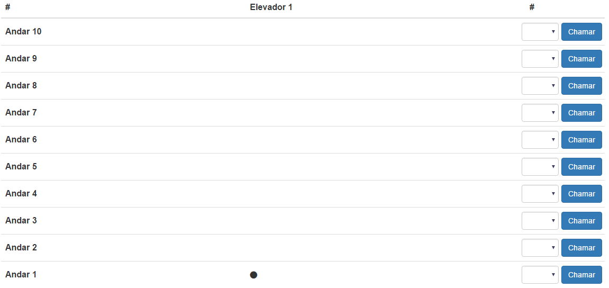
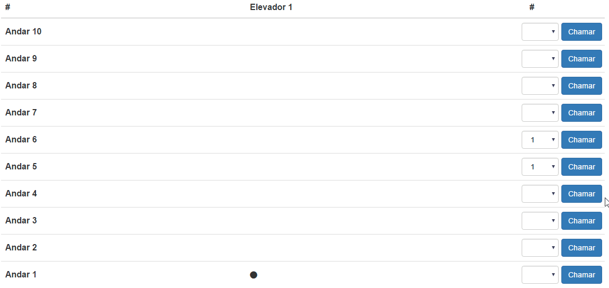

<h1 align="center">
   
  
   
  Elevador Inteligente
   
   
</h1>

<h4 align="center">Um sistema controlador de elevadores inteligentes</h4>
<h5 align="center">Automação Industrial</h5>

    
    

Este projeto trás uma implementação de um sistema de controle de elevadores para um cenario domestico/residencial. O intento otimizar o tempo de viagens e o consumo de energia.

## Cenarios

**Ao ser solicitado o elevador e outros passageiros, no caminho de destino, utilizarem o elevador na mesma viagem.**

**Ao ser solicitado o elevador e outros passageiros, fora do caminho de destino, esperarem por outra viagem.**

## Changelog

Para ver as mudanças neste projeto, consulte o [arquivo de mudanças](CHANGELOG.md).

## Contribuição

Para contribuir com este projeto, veja o arquivo com [dicas de contribuição](CONTRIBUTING.md) e o [código de conduta](CONDUCT.md).

## Licença

Este projeto é licenciado sob MIT License - veja o arquivo [LICENSE.md](LICENSE.md) para mais detalhes.